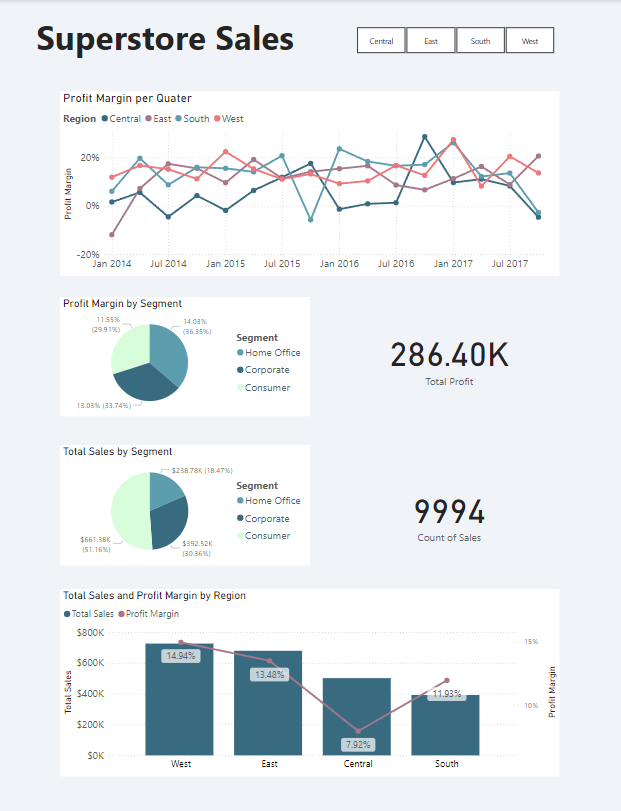

# SuperStore_Sales

## Objective:
Using a kaggle superstore dataset, data was explored and cleaned in SQL before using Power BI to visualise trends related towards company sales and profit metrics for owners and shareholders. Dashboard was created to give insights for which customer segments and regions should be prioritised to maximise profit margins and sales in the future.


## Tools used:
| SQL | cleaning and exploring |
| --- | ---  |
| Power BI | Visualising the data via interactive dashboards |

## Data Cleaning and Transformation

SQL was used to grab relevant columns

```SQL
select select Order_date, Segment, State, Region, Category, Sales, Quantity, Discount, Profit
from StoreData
```


Data transformation was completed in Power BI, where values were given the correct format. Then DAX measures were created to be used for the different charts and vizulisations on the dashboards. Finally, A date table was created and then joined to the sales table using a one-to-many relationship. This allows for certain metrics to be used to show both annually and quarterly.
Dax Measures
```Dax
Total Profit = SUM(Sales[Profit])
```
```Dax
Total Sales = SUM(Sales[Sales])
```
```DAX
Profit Margin = SUM(Sales[Profit]) / SUM(Sales[Sales])
```

Visualisation:



Analyse:
Dashboard indicates that while the profit margin between all 3 segments are fairly simulary, the consumer segments bring the most amount of money, suggesting that products in that segment cost more to ship  and are more expensive. Furthermore, searching by region profit margins for consumer segments increase for both the south and west regions, but decrease substantially in central and east regions, possibly indicating.

Regarding regions, both west and bring in the most sales and have the highest profit margins. Central on the significantly struggles to see profit margins despite fairly high revenue, again suggesting difficulty in shipping. Overtime, east and west have been the most consistent regions for profit margin by quarter usually in the 10-20% range with high Q4s. Central again struggles, hovering around the 1% range although having a couple of outlier quarters.

Recommendation:
Overall heavy focus on West and east regions as they regularly have high and consistent profit margins and generate the most sales. In the east , it makes it easier to ship products, possibly focusing on warehouses for stock. Also focus on Home office and corporate products. South looks into more consistent Q4s.
